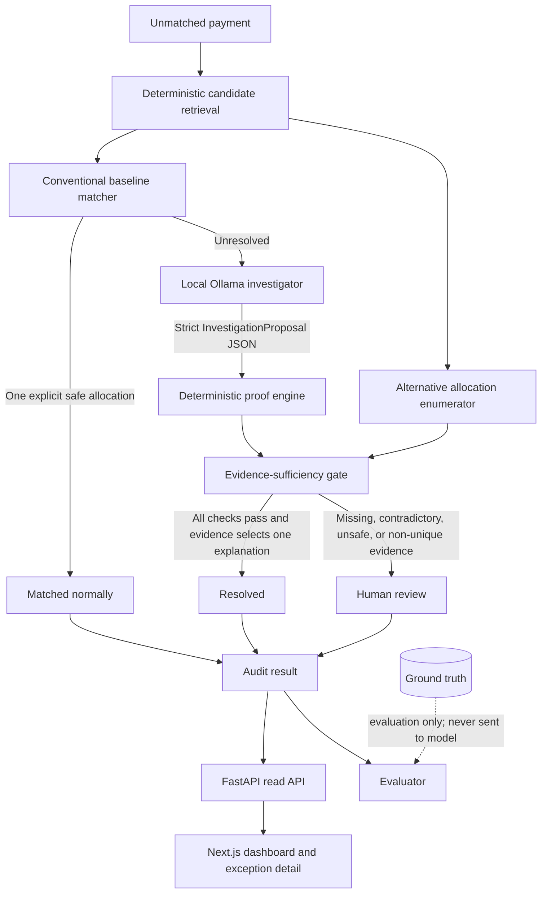

# Architecture

RemitProof separates interpretation from authorization. The model may suggest what a receipt means, but only deterministic code can authorize a result.

## Trust boundaries

The candidate retriever is deterministic. It narrows the corpus to at most three customers, eight invoices, three credits, and four remittance emails. This keeps prompts small and makes exhaustive alternative enumeration practical. Retrieval never reads ground truth.

The local `llama3.2` investigator receives only the payment and candidate bundle. It runs at temperature zero with a fixed seed and must return the `InvestigationProposal` schema. Schema-invalid proposal content is eligible for a correction loop of at most three total attempts; a mismatched proposal `payment_id` follows that same correction loop. Transport errors, timeouts, malformed outer-response JSON, and missing or invalid response envelopes fail safe immediately and yield human review rather than being retried.

The proposal is untrusted. The proof engine independently checks:

- invoice total minus valid credit total equals the payment using Python `Decimal`;
- invoice, credit, and payment states are eligible;
- every selected record uses the payment currency;
- no invoice or credit has already been consumed;
- the customer and payer relationship has explicit support;
- credits belong to selected invoices and are valid;
- remittance claims do not contradict credit-note amounts or identifiers.

The alternative finder exhaustively enumerates financially valid subsets inside the bounded candidate set. Evidence sufficiency authorizes only when the proposal itself passes proof and the available evidence uniquely identifies it. A second viable explanation without disambiguating evidence is a mandatory abstention.

## Decision policy

| State | Condition | Model involved? |
|---|---|---:|
| `matched_normally` | Conventional layer finds exactly one explicit, state-valid allocation | No |
| `resolved` | Proposal passes every proof and evidence uniquely supports it | Yes |
| `human_review` | Any proof fails, evidence conflicts or is missing, alternatives remain ambiguous, or the investigator fails | Possibly |

No branch performs production write-back. Decisions are serialized into benchmark artifacts and exposed through read-only endpoints.

## Main components

| Component | Responsibility |
|---|---|
| `candidate_retriever.py` | Deterministic, bounded retrieval |
| `baseline_matcher.py` | Conventional unique-match path |
| `ai_investigator.py` | Local structured semantic proposal |
| `proof_engine.py` | Independent arithmetic, state, currency, entity, credit, and contradiction checks |
| `alternative_finder.py` | Exhaustive financial hypotheses within candidates |
| `evidence_sufficiency.py` | Final authorization/abstention policy |
| `pipeline.py` | Single payment orchestration |
| `evaluator.py` | Three-way comparisons and generated metrics |

## Data flow and separation

The operational loaders read payments, invoices, customers, credits, and remittance emails. `ground_truth.json` is loaded only by the evaluator after processing each payment; it is never included in candidate retrieval, the prompt, proof, or final decision logic.

Generated `details.json` is the audit-facing projection used by the API. The UI reads the API only, so dashboard metrics, proof checks, allocations, and alternatives all trace back to generated run artifacts rather than presentation constants.

## Operational health

`GET /live` is an unconditional process-liveness signal. `GET /ready` verifies that the required generated result artifacts are present, readable, and schema-compatible before reporting ready; missing or malformed artifacts return `503`. `GET /health` is retained as a backward-compatible alias for readiness and must return the same status as `/ready`.

## Prototype boundaries

This is an evaluation-grade, file-backed MVP. It has no authentication, database, queue, webhook ingestion, live Razorpay connection, FX engine, settlement, or accounting write-back. The architecture deliberately optimizes for inspectable safety behavior, not production scale.
